<div align="center">
  
<h1>░▒▓█ SentinelSift █▓▒░</h1>

</div>

> Cognitive Community Analysis Suite

[](https://sentinelsift.vercel.app)
[](LICENSE)
[](https://openai.com)

<div align="center">
  
</div>

<div align="center">
  
**[Explore SentinelSift](https://sentinelsift.vercel.app)**  

</div>

<div align="center">
  <video width="320" height="240" controls>
    <source src="/sentinelsift.mp4" type="video/mp4">
    Your browser does not support the video tag.
  </video>
</div>

https://github.com/user-attachments/assets/6a6f3dc2-b13f-4661-9cc1-b6e16678631d

## 🧠 **Neural Core Features**

- ⚡︎ Adaptive Sentiment Radar  
- ⚡︎ Cognitive Dissonance Detection  
- ⚡︎ Real-time Pattern Analysis  
- ⚡︎ Multi-Model Fallback System
- ⚡︎ Priority Based Engine
- ⚡︎ Active inference Engine Status
- ⚡︎ Encrypted API Vault  
- ⚡︎ FTC-Compliant

## 🛠️ **Installation Protocol**

```bash
# Clone neural repository
git clone https://github.com/ahmedjidar/SentinelSift-social-media-sentiment-analyzer.git

# Install dependencies
npm install

# Configure environment
cp .env.example .env
```

## ⚙️ **Configuration Matrix**

```env
# .env
OPENAI_API_KEY="sk-...xxxx"         # Neural Core
HF_API_KEY="hf_...xxxx"            # Neural Core
HF_API_KEY="hf_...xxxx"            # Fallback Engine
REDIS_URL="redis://..."            # Rate limiting
...
```

## 🚀 **Launch Sequence**

```bash
# Development mode
npm run dev

# Build neural interface
npm run build

# Deploy to production
vercel --prod
```

## 🧩 **Tech Stack**

<div align="center">
  
| **Layer**          | **Components**                                                                 |
|---------------------|--------------------------------------------------------------------------------|
| Neuro Interface     |    |
| Cognitive Engine    |   |
| Data Source         |  |
| Rate Limiting       |  |
| Analysis Grid       |  |

</div>

## 🛰️ **Deployment Schematic**

```mermaid
graph LR
  A[User Input] --> B[Redis Rate Limiting]
  B --> C((Neuro Interface))
  C --> D{Cognitive Engine}
  D --> E[Priority Engine]
  E -->|First Valid API Key| F{{Primary Model}}
  F --> G{Analysis Success?}
  G -->|Yes| H[Sentiment Processing]
  G -->|No| I{{Fallback Model}}
  I --> H
  H --> J[Visualization Grid]
  
  classDef dynamic fill:#2e6a7e,stroke:#34d399;
  classDef fallback fill:#4a2e6a,stroke:#9b59b6;
  classDef storage fill:#2e4a3c,stroke:#2ecc71;
  
  class B storage;
  class E,F dynamic;
  class I fallback;
```



## ⚠️ **Security**

- API keys stored in a Secure HTTP-only cookies 🔒
- SameSite strict enforcement 🛡️
- AES-256-GCM encryption ⚡
- Regular security audits 🔍

## 🤝 **Neural Collective**

Contribute to the cognitive network:

1. Fork the repository
2. Create feature branch (`git checkout -b neuro/feature`)
3. Commit changes (`git commit -m 'Add synaptic connection'`)
4. Push to branch (`git push origin neuro/feature`)
5. Open a PR with protocol documentation

## 📜 **License**

```text
░░▒▒▓▓██ MIT License ██▓▓▒▒░░

Permission is hereby granted, free of charge, to any neural entity obtaining a copy...
```

---

<div align="center">
  
**[Explore the Cognitive Grid](https://sentinelsift.vercel.app)**  

</div>
