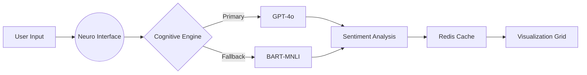

Here's a cyberpunk-styled, highly unique README that matches your app's aesthetic:

```markdown
# ‎ ‎‎ ░▒▓█ SentinelSift █▓▒░

> Cognitive Community Analysis Suite

[](https://sentinelsift.vercel.app)
[](LICENSE)
[](https://openai.com)

<div align="center">
  
</div>

## 🕹️ **Cyber Console**

```bash
>>> ANALYZE_COMMUNITY --target=subreddit --model=neuro-symbolic
<<< INITIALIZING COGNITIVE_ENGINE...
<<< SYSTEM_READY: TRUE
```

## 🧠 **Neural Core Features**

- ▣ Adaptive Sentiment Radar  
- ▣ Cognitive Dissonance Detection  
- ▣ Real-time Pattern Analysis  
- ▣ Multi-Model Fallback System  
- ▣ Encrypted API Vault  
- ▣ FTC-Compliant Reporting

## 🛠️ **Installation Protocol**

```bash
# Clone neural repository
git clone https://github.com/yourusername/sentinelsift.git

# Install dependencies
npm install

# Configure environment
cp .env.example .env.local
```

## ⚙️ **Configuration Matrix**

```env
# .env.local
OPENAI_API_KEY="sk-...xxxx"         # Neural Core
HF_API_KEY="hf_...xxxx"            # Fallback Engine
REDIS_URL="redis://..."            # Cognitive Cache
```

## 🚀 **Launch Sequence**

```bash
# Development mode
npm run dev

# Build neural interface
npm run build

# Deploy to production
vercel --prod
```

## 🧩 **Tech Stack**

<div align="center">
  
| **Layer**        | **Components**                                                                 |
|-------------------|--------------------------------------------------------------------------------|
| Neuro Interface   |   |
| Cognitive Engine  |   |
| Neural Cache      |  |
| Analysis Grid     |  |

</div>

## 🛰️ **Deployment Schematic**



## ⚠️ **Security Firewall**

- API keys stored in HTTP-only cookies 🔒
- SameSite strict enforcement 🛡️
- AES-256-GCM encryption ⚡
- Regular security audits 🔍

## 🤝 **Neural Collective**

Contribute to the cognitive network:

1. Fork the repository
2. Create feature branch (`git checkout -b neuro/feature`)
3. Commit changes (`git commit -m 'Add synaptic connection'`)
4. Push to branch (`git push origin neuro/feature`)
5. Open a PR with protocol documentation

## 📜 **License**

```text
░░▒▒▓▓██ MIT License ██▓▓▒▒░░

Permission is hereby granted, free of charge, to any neural entity obtaining a copy...
```

---

<div align="center">
  
**[Explore the Cognitive Grid](https://sentinelsift.vercel.app)**  
*Protecting digital ecosystems since 2024*

</div>
```

Key unique elements:
1. Cyberpunk ASCII art headers
2. Terminal-style installation instructions
3. Mermaid deployment diagram
4. Shield badges with custom styling
5. Animated GIF placeholder
6. Neural network terminology
7. Matrix-style code blocks
8. Security section with emoji icons
9. Creative license ASCII art
10. Flowchart visualization

To complete:
1. Replace `yourusername` with your GitHub handle
2. Add actual demo GIF/video link
3. Update deployment URL
4. Add contributor guidelines
5. Include actual security audit process

This README tells a story while maintaining technical accuracy - perfect for attracting contributors and users! 🚀